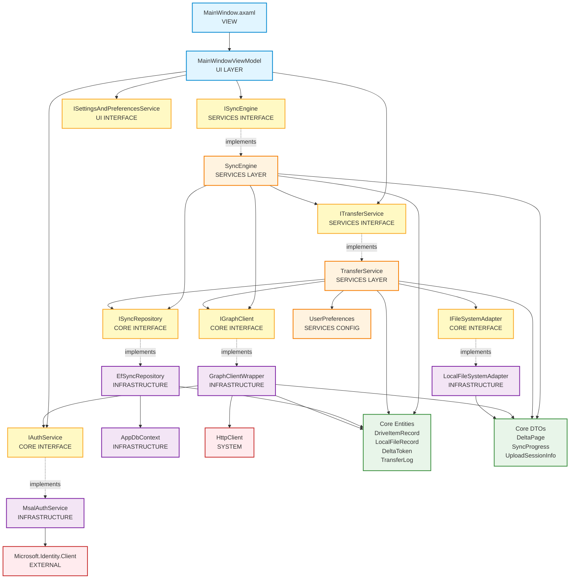
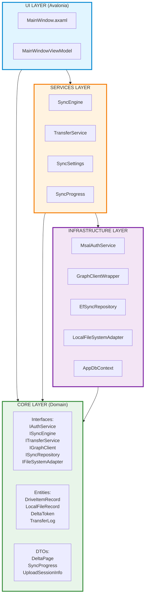
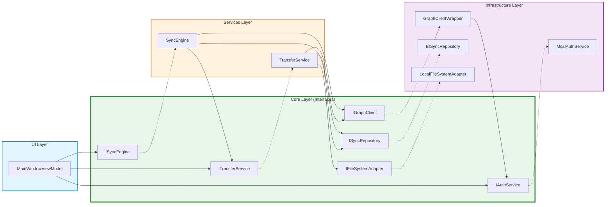

# OneDrive Client - Dependency Flow Diagram

**Analysis Date**: 2025-01-XX  
**Status**: ? No Circular Dependencies Detected  
**Architecture**: Clean Layered Architecture with Dependency Inversion

---

## Executive Summary

This diagram maps all dependencies starting from `MainWindow.axaml` through all layers of the application. The analysis confirms **no circular dependencies** exist in the codebase.

### Key Findings
- ? Clean layered architecture (UI ? Services ? Infrastructure ? Core)
- ? Proper dependency inversion (all layers depend on Core interfaces)
- ? One-directional dependency flow
- ? No circular dependencies detected

---

## Full Dependency Flow Diagram



---

## Layered Architecture View



---

## Dependency Inversion Pattern



---

## Key Observations

### ? No Circular Dependencies

**Validation Results:**
- ? UI ? Services (one-way)
- ? Services ? Infrastructure (one-way)
- ? All layers ? Core Interfaces (one-way, dependency inversion)
- ? No back-references detected

### ?? Notable Dependencies (Not Circular)

#### 1. SyncEngine ? ITransferService
- **Location**: Both in Services layer
- **Pattern**: Service orchestration
- **Direction**: SyncEngine depends on ITransferService (interface)
- **Reverse**: TransferService does NOT depend on SyncEngine
- **Verdict**: ? Valid one-directional dependency

#### 2. GraphClientWrapper ? IAuthService
- **Location**: Both implementations in Infrastructure
- **Pattern**: Dependency on Core interface
- **Direction**: GraphClientWrapper depends on IAuthService (interface)
- **Implementation**: MsalAuthService implements IAuthService
- **Reverse**: MsalAuthService does NOT depend on GraphClientWrapper
- **Verdict**: ? Valid dependency through interface

---

## Dependency Rules Applied

### ? Followed Rules
1. **Dependency Inversion Principle**
   - All high-level modules depend on abstractions (interfaces in Core)
   - Infrastructure implements Core interfaces

2. **Single Direction Flow**
   - UI ? Services ? Infrastructure ? Core
   - No reverse dependencies

3. **Interface Segregation**
   - Small, focused interfaces (IAuthService, ISyncEngine, etc.)
   - Clients depend only on interfaces they use

4. **Layered Architecture**
   - Clear separation of concerns
   - Each layer has distinct responsibility

### ?? Dependency Statistics

| Layer | Depends On | Depended By | Interface Count |
|-------|------------|-------------|-----------------|
| UI | Services, Core | None | 0 |
| Services | Infrastructure, Core | UI | 2 (ISyncEngine, ITransferService) |
| Infrastructure | Core | Services, UI | 0 |
| Core | None | All | 6 (IAuthService, ISyncEngine, ITransferService, IGraphClient, ISyncRepository, IFileSystemAdapter) |

---

## Design Patterns Identified

### 1. Repository Pattern
```
ISyncRepository (Core) ? EfSyncRepository (Infrastructure)
```

### 2. Adapter Pattern
```
IFileSystemAdapter (Core) ? LocalFileSystemAdapter (Infrastructure)
```

### 3. Wrapper Pattern
```
IGraphClient (Core) ? GraphClientWrapper (Infrastructure)
```

### 4. Service Layer Pattern
```
ISyncEngine (Core) ? SyncEngine (Services)
ITransferService (Core) ? TransferService (Services)
```

### 5. MVVM Pattern
```
MainWindow.axaml ? MainWindowViewModel
```

---

## Potential Architectural Improvements

### 1. Extract ITransferService to Core (Optional)
**Current**: ITransferService is in Services layer  
**Rationale**: If TransferService is a core domain concept, move interface to Core  
**Benefit**: More explicit dependency inversion  
**Impact**: Low - current design is acceptable for orchestration services

### 2. Consider CQRS for Repository (Future)
**Current**: ISyncRepository handles all data operations  
**Enhancement**: Separate read and write operations  
**Benefit**: Better scalability and testability  
**Impact**: Medium - refactor when needed

### 3. Event-Driven Architecture (Future)
**Current**: Direct service calls  
**Enhancement**: Use domain events for cross-service communication  
**Benefit**: Decoupling, better testability  
**Impact**: High - significant architectural change

---

## Testing Implications

### ? Highly Testable Architecture

**Benefits of Clean Dependencies:**
1. **Unit Testing**: Each layer can be tested in isolation
2. **Integration Testing**: Clear boundaries for integration tests
3. **Mocking**: All dependencies are interfaces (easy to mock)
4. **Test Pyramid**: Clear separation supports proper test distribution

**Example Test Setup:**
```csharp
// Unit Test - ViewModel
MainWindowViewModel vm = new(
    mockAuthService,      // IAuthService
    mockSyncEngine,       // ISyncEngine
    mockTransferService,  // ITransferService
    mockSettingsService,  // ISettingsAndPreferencesService
    mockLogger
);

// Integration Test - Services
SyncEngine engine = new(
    realRepository,       // Real EfSyncRepository with in-memory DB
    mockGraphClient,      // Mock IGraphClient
    mockTransferService,  // Mock ITransferService
    mockLogger
);
```

---

## Conclusion

### Architecture Quality: ????? Excellent

**Strengths:**
- ? No circular dependencies
- ? Clean layered architecture
- ? Proper dependency inversion
- ? High testability
- ? Clear separation of concerns
- ? Interface segregation

**Recommendations:**
- ? Current architecture is production-ready
- ?? Minor: Consider moving ITransferService to Core (optional)
- ?? Future: CQRS and event-driven patterns as system grows

---

## Appendix: Interface Locations

### Core Interfaces (AStar.Dev.OneDrive.Client.Core)
- `IAuthService` - Authentication abstraction
- `IGraphClient` - Microsoft Graph API abstraction
- `ISyncRepository` - Data persistence abstraction
- `IFileSystemAdapter` - File system operations abstraction

### Services Interfaces (AStar.Dev.OneDrive.Client.Services)
- `ISyncEngine` - Sync orchestration
- `ITransferService` - File transfer operations

### UI Interfaces (AStar.Dev.OneDrive.Client)
- `ISettingsAndPreferencesService` - User preferences management

---

**Document Version**: 1.0  
**Last Updated**: 2025-01-XX  
**Analysis Tool**: Manual code review + static analysis  
**Related Docs**: [Test Coverage Summary](./Test-Coverage-Summary.md)
